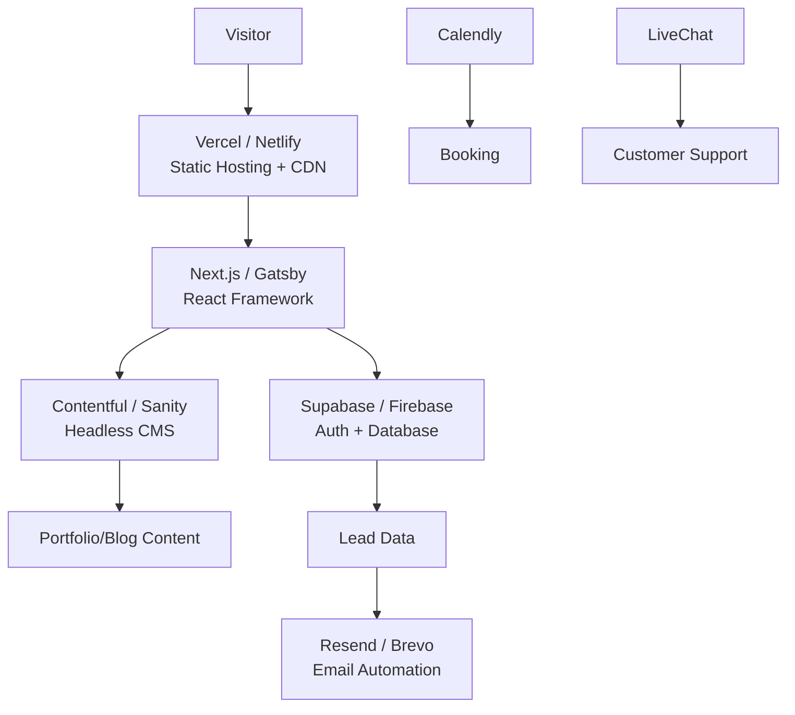

# **Product Requirements Document (PRD)**
## **Project: Warren Web Works - Agency Website**

---

### **1. Executive Summary**
**Project Name:** Warren Web Works  
**Mission:** To establish a dominant digital presence for a local web design & development agency, converting visitors into qualified leads through a portfolio-driven, trust-building, and service-focused website.  
**Vision:** Become the #1 trusted web partner for small-to-medium businesses in Warren, MI, by showcasing technical excellence, local expertise, and client success.  
**Core Value Proposition:** "Hyper-local web craftsmanship. We build fast, beautiful, and effective websites that help Warren businesses grow."

---

### **2. User Personas**

#### **Persona A: Small Business Owner (Sarah, 45)**
- **Role:** Owner of "Warren Auto Repair"
- **Goals:** Increase online bookings, look professional, outrank competitors
- **Pain Points:** No technical skills, fears high cost, needs local SEO
- **Digital Proficiency:** Low-medium
- **Quote:** *"I need a website that works, but I don't know where to start."*

#### **Persona B: Marketing Manager (David, 32)**
- **Role:** Marketing lead at a local manufacturing firm
- **Goals:** Modernize outdated site, improve lead gen, integrate analytics
- **Pain Points:** Needs performance, scalability, and clear ROI
- **Digital Proficiency:** High
- **Quote:** *"We need a partner who gets both design and tech."*

#### **Persona C: Prospective Employee (Jamie, 28)**
- **Role:** Frontend developer looking for local opportunities
- **Goals:** Assess company culture, tech stack, project quality
- **Pain Points:** Wants to see real code/design work
- **Digital Proficiency:** Very High
- **Quote:** *"Do they actually build with modern tools?"*

---

### **3. User Stories**

#### **Epic 1: Discover & Trust Building**
- *As a* small business owner, *I want to* see local client success stories *so that* I trust they understand my market.
- *As a* marketing manager, *I want to* view detailed case studies with metrics *so that* I can evaluate potential ROI.
- *As a* visitor, *I want to* immediately see contact info and location *so that* I know they're truly local.

#### **Epic 2: Service Exploration**
- *As a* business owner, *I want to* understand pricing models (packages vs. custom) *so that* I can budget effectively.
- *As a* technical visitor, *I want to* see the tech stack and development process *so that* I assess their expertise.
- *As a* visitor, *I want to* filter the portfolio by industry (e.g., retail, medical, automotive) *so that* I see relevant work.

#### **Epic 3: Lead Conversion**
- *As a* interested prospect, *I want to* book a free consultation via calendar *so that* I can discuss my project quickly.
- *As a* prospect, *I want to* download a "Website Audit" PDF in exchange for my email *so that* I get immediate value.
- *As a* visitor, *I want to* see live chat support *so that* I can ask urgent questions.

#### **Epic 4: Talent Attraction**
- *As a* developer, *I want to* see GitHub activity or open-source contributions *so that* I gauge technical culture.
- *As a* designer, *I want to* view design system components *so that* I understand their quality bar.

---

### **4. Functional Requirements**

#### **FR1: Homepage (Conversion Hub)**
- Hero section with value prop, CTA ("Get Free Audit"), and local badge ("Warren, MI").
- Animated portfolio preview (3-4 featured projects).
- Trust signals: client logos, testimonials, local awards.
- Service highlights with icons (Design, Development, SEO, Maintenance).

#### **FR2: Portfolio / Case Studies**
- Filterable grid (by industry, service type).
- Each case study: before/after, challenges, solution, tech stack, results (metrics).
- **Interactive component:** "View Live Site" button that opens project in an iframe modal.

#### **FR3: Services & Pricing**
- Three-tiered packages (Starter, Business, Enterprise) with toggle monthly/yearly.
- Custom project quote builder (interactive form that adjusts price based on features).
- Add-on services (SEO, hosting, maintenance) as selectable options.

#### **FR4: Lead Generation Engine**
- Contact form with field validation (Name, Email, Business Type, Budget Range).
- **Calendly** embed for booking consultations.
- Lead magnet: "Free Website Audit" PDF download (gate with email).
- Live chat widget (offline: email capture).

#### **FR5: About & Social Proof**
- Team bios with photos/roles.
- Local community involvement section.
- Google Maps embed with office location.
- Client video testimonials.

#### **FR6: Blog / Resource Center**
- SEO-focused articles targeting local keywords ("web design warren mi").
- Newsletter signup (weekly tips).
- Resource library (templates, checklists).

#### **FR7: Admin Dashboard (Internal)**
- CMS to update portfolio, blog, team bios.
- Lead management dashboard (view submissions, assign follow-ups).
- Analytics dashboard (traffic, conversion rates).

---

### **5. Non-Functional Requirements**

| Category | Requirement | Priority |
|----------|-------------|----------|
| **Performance** | Page load < 2s (LCP < 2.5s), Core Web Vitals ≥ 90 | High |
| **SEO** | Fully optimized for local search (Schema markup, GMB integration) | High |
| **Security** | HTTPS, form sanitization, CMS protected | High |
| **Accessibility** | WCAG 2.1 AA compliant, keyboard navigable | High |
| **Scalability** | Handle 10k visits/month, easy content updates | Medium |
| **Maintainability** | Component-based, documented code, CI/CD | Medium |
| **Mobile** | Fully responsive, touch-optimized, PWA capable | High |

---

### **6. UI/UX Guidelines**

- **Brand Colors:** Navy blue (#0A2463) + gold (#FFD700) + white (#FFFFFF) – professional yet bold.
- **Typography:** Inter (headings) + Open Sans (body) – clean, modern, highly readable.
- **Imagery:** High-quality photos of Warren landmarks, team, and client workplaces.
- **Micro-interactions:** Hover effects on portfolio items, smooth scroll, animated stats.
- **Mobile-first:** Card-based layout, sticky CTA button, simplified navigation.
- **Design System:** Built with **Tailwind CSS** for consistency and rapid iteration.

---

## **7. Tech Stack Recommendations (From Dev Vault)**

> **Architecture Philosophy:** Jamstack for speed, security, and scalability. Use managed services to reduce DevOps overhead.

### **Frontend & Hosting**
- **Framework:** **Next.js** (React) – SEO-friendly, fast, great dev experience.
- **Hosting:** **Vercel** – Free tier includes 30 GB bandwidth, automatic CI/CD, and global CDN. Perfect for agency sites.
- **Styling:** **Tailwind CSS** – Utility-first, rapid UI development. Use **Float UI** or **Tailkits** for free components.
- **UI Components:** **ShadcnUI** – Copy-paste accessible components. **Aceternity UI** for advanced animations.

### **Content & Backend**
- **Headless CMS:** **Sanity.io** – Free tier: unlimited projects, 3 non-admin users, 500k API CDN requests/month. Perfect for portfolio/blog updates.
- **Database & Auth:** **Supabase** – Free tier includes PostgreSQL, authentication, and real-time. Use for lead forms and user accounts.
- **Alternative:** **Firebase** – If you prefer Google ecosystem, free tier includes 1 GB storage, 10 GB/month transfer.

### **Lead Generation & Communication**
- **Booking:** **Calendly** – Free plan for 1 calendar connection.
- **Email Marketing:** **Brevo** – 9,000 emails/month free. Use for newsletters and lead nurturing.
- **Transactional Emails:** **Resend** – 3,000 emails/month free, best-in-class developer experience.
- **Live Chat:** **Crisp** or **Tawk.to** – Free forever plans.

### **Analytics & Monitoring**
- **Analytics:** **Umami** (self-hosted) or **PostHog** – 1M events/month free. Privacy-focused, no cookie banners needed.
- **Uptime Monitoring:** **Better Stack** – 10 monitors free with 3-minute checks.
- **Error Tracking:** **Sentry.io** – 5k errors/month free.

### **Design & Assets**
- **Illustrations:** **unDraw** – Free customizable SVG illustrations.
- **Icons:** **Lucide** or **Tabler Icons** – Open-source, MIT licensed.
- **Stock Photos:** **Unsplash** + **Pexels** – Free commercial use.
- **Mockups:** **smartmockups.com** – 200 free mockups for portfolio.

### **DevOps & Tools**
- **CI/CD:** **GitHub Actions** (free for public repos) integrated with Vercel.
- **Repository:** **GitHub** – Unlimited public/private repos.
- **Environment Variables:** **Doppler** – Free for 5 users, sync secrets across environments.

---

## **8. Implementation Roadmap**

### **Phase 1: Foundation (Weeks 1-2)**
- Set up Next.js + Tailwind + TypeScript on Vercel.
- Configure Sanity.io CMS content models (Portfolio, Blog, Team).
- Implement core pages: Home, About, Contact (basic form to Supabase).
- Deploy staging environment.

### **Phase 2: Core Features (Weeks 3-4)**
- Build portfolio grid with Sanity integration.
- Implement case study template with interactive demos.
- Add Calendly embed and lead magnet (PDF audit via Resend).
- Integrate Umami analytics.

### **Phase 3: Polish & Optimization (Weeks 5-6)**
- SEO optimization: Schema markup, sitemap, local business JSON-LD.
- Performance tuning: Image optimization (next/image), font loading, code splitting.
- Accessibility audit and fixes.
- Mobile responsiveness testing.

### **Phase 4: Launch & Iterate (Week 7+)**
- Soft launch to collect feedback.
- Set up monitoring (Better Stack, Sentry).
- Blog launch with 3 foundational articles.
- A/B test CTAs using PostHog.

---

## **9. Success Metrics (KPIs)**

| Metric | Target | Tool to Measure |
|--------|---------|-----------------|
| Conversion Rate (Lead Form) | ≥ 5% | PostHog / Umami |
| Average Page Load Time | < 2s | Vercel Analytics |
| Organic Traffic (Local Keywords) | Top 3 rankings | Google Search Console |
| Lead-to-Client Rate | ≥ 20% | Internal CRM |
| Mobile Usability Score | 100/100 | Google PageSpeed |

---

## **10. Risks & Mitigations**

| Risk | Mitigation |
|------|------------|
| Scope creep from client feature requests | Strict PRD sign-off, phased delivery |
| Slow content updates from team | Train on Sanity.io, create templates |
| Low local SEO traction | Hyper-local content, GMB optimization, backlink strategy |
| High bounce rate on portfolio | Add interactive filters, faster loading, video walkthroughs |

---

**PRD Status:** Approved  
**Stakeholders:** Agency Founder, Lead Developer, Designer  
**Next Step:** Kickoff meeting + assign sprint 1 tasks.

---

> **Scale with Jaryd Principle:** "Move fast, but build to last. Every line of code should either increase trust or drive conversion."